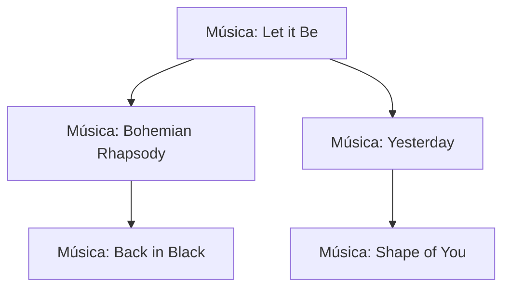
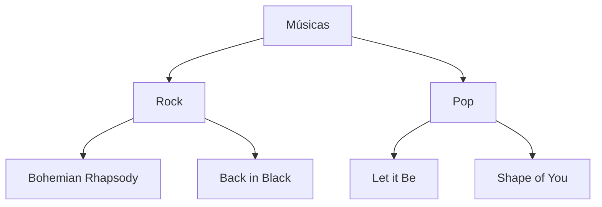

# Projeto: Comparativo de Estruturas de Dados em C

Este projeto tem como objetivo comparar o desempenho de duas estruturas de dados distintas — Árvore Binária de Busca (ABB) e uma estrutura baseada em Árvore com Listas (generalizada) — ao lidar com um conjunto real de dados musicais.

Trabalho da disciplina **AC2 - Estrutura de Dados**, ministrada pela Profª Tiemi C. Sakata.

---

## 🔢 Objetivo

Implementar duas estruturas de dados utilizando **TADs em C** para:

* Inserir, buscar e exibir dados musicais de um arquivo CSV.
* Comparar desempenho (tempo) das operações em cada estrutura.
* Realizar análises gráficas e apresentar resultados.

---

## 📁 Estrutura de Pastas

```bash
projeto-arvores/
│
├── data/
│   └── top_500_musicas.csv      # Arquivo CSV reduzido
│
├── include/
│   ├── bst.h                    # Header da árvore binária
│   └── list_tree.h              # Header da árvore em lista
│
├── src/
│   ├── bst.c                    # Implementação da árvore binária
│   ├── list_tree.c              # Implementação da árvore com listas
│   ├── utils.c                  # Leitura do CSV e funções auxiliares
│   └── main.c                   # Execução principal e comparação
│
├── CMakeLists.txt                # Compilação do projeto (sem Makefile)
└── README.md                   # Este arquivo
```

---

## 🔹 Explicação Visual das Estruturas

### ✨ Estrutura: Árvore Binária de Busca (ABB)



* Cada nó possui no máximo dois filhos.
* Ordenação com base em `track_name`.

---

### 📚 Estrutura: Árvore com Lista de Filhos



* Cada nó pode ter vários filhos.
* Estrutura semelhante a uma classificação por gênero.

---

## 🔄 Etapas

1. **Redução do dataset** para 500 músicas
2. **Implementação da ABB** (`bst.c` e `bst.h`)
3. **Implementação da árvore em lista** (`list_tree.c` e `list_tree.h`)
4. **Leitura do CSV** com `utils.c`
5. **Medição de desempenho** (tempo de inserção, busca)
6. **Análise comparativa com gráficos**
7. **Apresentação e relatório**

---

## 📈 Métricas que Serão Avaliadas

* Tempo de inserção (em milissegundos)
* Tempo de busca
* Complexidade observada (empírica)

---

## ⚒️ Como compilar (exemplo CMake)

Crie o seguinte `CMakeLists.txt` na raiz do projeto:

```cmake
cmake_minimum_required(VERSION 3.10)
project(projeto_arvores)

set(CMAKE_C_STANDARD 11)

include_directories(include)

add_executable(projeto_arvores
    src/main.c
    src/bst.c
    src/list_tree.c
    src/utils.c
)
```

Depois:

```bash
mkdir build
cd build
cmake ..
make
./projeto_arvores
```

---

## 💡 Créditos

* Edson (FACENS)
* Eduardo (FACENS)
* Kaique (FACENS)
* Micael (FACENS)
* Náthalia (FACENS)

* **Professora Tiemi C. Sakata — AC2**

---

Vamos codar! ✨
